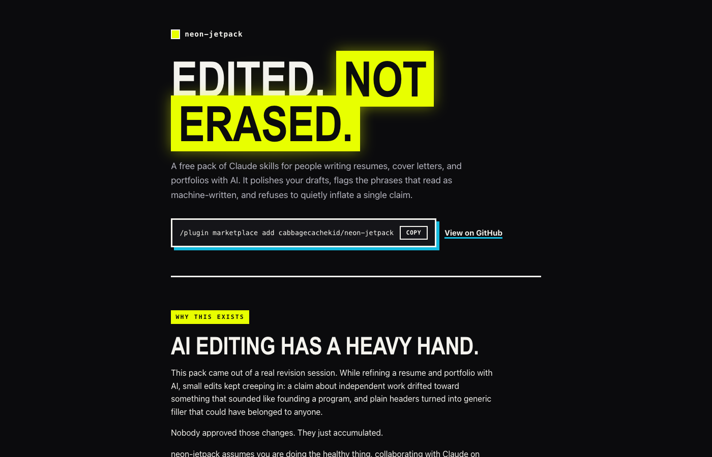
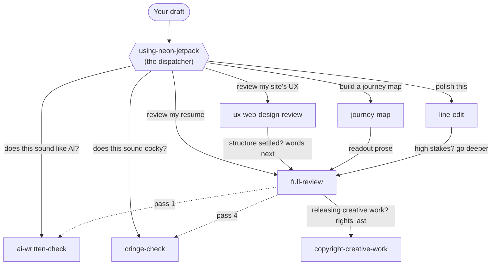

# neon-jetpack



**Free skills that keep AI-assisted writing honest and yours.** Made for anyone using Claude to work on a resume, cover letter, portfolio, proposal, or creative project.

If you've ever asked AI to "improve" your writing and gotten back something that didn't sound like you anymore, or that silently made your accomplishments bigger than they really were, this pack is for you. It happened to the author while refining a resume: small edits kept creeping in that inflated claims and sanded the voice out, and nobody had approved them. neon-jetpack makes sure the finished writing says what you meant, claims only what's true, and still sounds like you.

## What's a "skill"?

A skill is a set of instructions you add to Claude that teaches it how to do a specific job well. You install it once, and from then on Claude uses it automatically whenever you ask for that kind of help. No coding involved.

## How to install

**On claude.ai (the website or desktop app):**

1. Download this repository: click the green **Code** button at the top of this page, then **Download ZIP**, and unzip it.
2. In Claude, open **Settings**, then **Capabilities**, and find **Skills**.
3. Upload the skill folders you want from the `skills/` folder (each folder is one skill).
4. That's it. Start a new chat and ask away.

**In Claude Code (the terminal or desktop coding app):**

Type these two commands:

```
/plugin marketplace add cabbagecachekid/neon-jetpack
/plugin install neon-jetpack@neon-jetpack
```

You can also install just one skill: copy its folder from `skills/` into `~/.claude/skills/` on your computer. Every skill works on its own.

## How to use it

Just talk to Claude normally. Paste in your draft and say what you want:

- *"Polish this email before I send it."*
- *"Does this cover letter sound like AI wrote it?"*
- *"Does this bio sound cocky?"*
- *"Run a full review on my resume."*
- *"Review my portfolio site's UX."*
- *"Build a journey map for my app."*
- *"I'm about to release this song. How do I protect it?"*

Claude picks the right skill (or the right sequence of them) and tells you which one it's using.

## What each skill does

| Skill | What it does for you | What to say |
|-------|-----|-----|
| **line-edit** | Cleans up grammar, wordiness, and awkward sentences without rewriting you. You get a polished version plus a short list of judgment calls you can veto. | "polish this," "proofread this" |
| **ai-written-check** | Finds the patterns that make writing feel machine-made (em dashes, formulaic lists, robotic rhythm) and suggests a fix for each one. | "does this sound like AI?" |
| **cringe-check** | Checks whether your tone reads as arrogant, try-hard, or like you're parroting the job posting. | "does this sound cocky?" |
| **full-review** | The deep clean for high-stakes writing (resumes, proposals, portfolios). Six passes including honesty checks, shown as a before/after table. Nothing changes until you approve it. | "review my copy," "full review" |
| **ux-web-design-review** | Reviews your website or page against real usability research, with sources cited, and tells you what's evidence-backed versus just trendy. | "review my site's UX" |
| **journey-map** | Interviews you about your users, then builds a journey map organized around real user moments instead of app screens. Works in FigJam if you have Figma connected, or as a table if not. | "build a journey map" |
| **copyright-creative-work** | Walks you through US copyright basics before you release a song, photos, or writing: registration, split sheets, what to do first. Educational, not legal advice. | "how do I protect this before I post it?" |

There's also a behind-the-scenes skill, **using-neon-jetpack**, that helps Claude pick the right skill and run them in the right order. You never need to call it yourself.

## Registers and profiles (v0.2)

The three writing-honesty skills (ai-written-check, cringe-check, full-review) are shared with the smaller [red-pen](https://github.com/cabbagecachekid/red-pen) pack and are the same files. As of v0.2 they can be calibrated per kind of writing: a **register** file says which way AI editing damages that kind of artifact (résumés inflate; editorials soften), and an optional one-page **profile** in your writing folder records your voice and names your register. With neither, everything runs exactly as before: the résumé calibration, `job-seeker`. See red-pen's README for the full explanation; the `registers/` folder and `profile.template.md` here are the same files.

## How the skills work together

You say what you need; the dispatcher routes it. Solid arrows are the paths you take; dotted arrows are checks that `full-review` runs for you automatically (so you never run those separately).



## The promises every skill keeps

1. **Nothing changes without your okay.** You see the findings first.
2. **Your claims never get inflated.** If an edit would make something sound bigger than the truth, Claude stops and asks.
3. **Your voice survives.** A rough, specific sentence of yours beats a smooth, generic one.
4. **You're told what wasn't checked.** Every review ends by saying which passes ran and which didn't.

## Common questions

**Is it free?** Yes. MIT-licensed, no accounts, no tracking. You just need Claude.

**Do I need all seven?** No. Each skill stands alone. Install what you'll use.

**Does my writing go anywhere?** These skills are instructions, not software. Your text goes only where it already goes: to Claude in your own chat.

**Which one should I try first?** If you're job hunting, install `full-review`, `ai-written-check`, and `cringe-check` together, then say "run a full review on my cover letter."

## The website

A landing page for the pack lives in [`docs/`](docs/index.html). It's built for GitHub Pages (deploy from branch, `/docs` folder) and goes live at `cabbagecachekid.github.io/neon-jetpack/` once the repo is public and Pages is enabled.

## For skill authors

Built to [Anthropic's skill-authoring best practices](https://platform.claude.com/docs/en/agents-and-tools/agent-skills/best-practices):

- **Progressive disclosure.** Each `SKILL.md` is a lean checklist; catalogs, worked examples, and cited sources live in `references/` and load only when needed.
- **Composition, not duplication.** `full-review` invokes the focused checks rather than restating them, so each rule has one source of truth. It falls back to built-in notes if the two checks aren't installed.
- **Reasoning, not bare rules.** Every rule says *why*, so the model generalizes instead of pattern-matching.
- **No scripts.** These are judgment tasks; guidance is prose, not code.

## License

MIT
