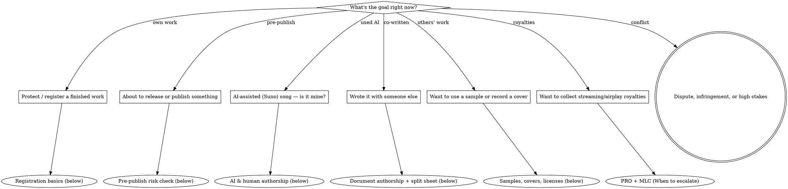

# Copyright Your Creative Work

## Standing disclaimer (say this, don't bury it)

This skill is **informational, not legal advice.** It does not create an
attorney–client relationship. It is **US-focused** — copyright law is
jurisdiction-specific, and your results differ outside the US. Real protection
comes from **registration**, and when stakes are high (money, disputes, anything
you'd hate to lose), from a **lawyer**. When in doubt, escalate.

This skill is for protecting and managing **your own** creative work. It is
**not** a tool for reproducing, checking, or assessing other people's
copyrighted material.

## Core principle

Copyright exists **automatically** the moment you fix an original work in a
tangible form (record the track, type the lyrics, save the photo). But
automatic copyright has almost no teeth. **Registration** is what lets you sue
and what unlocks statutory damages. And for AI-assisted work, **only the parts a
human authored are protectable at all.**

So the job is rarely "do I have copyright" — it's **"what do I do next."** This
skill is decision-oriented: find your situation, take the next action.

## Start here — what are you trying to do?

## The two copyrights in a song

A song is **two separate copyrights**. They can be owned by different people and
must be handled separately.

| | Musical composition | Sound recording |
|---|---|---|
| What it is | The underlying song: melody + lyrics | One specific recorded performance of it |
| Office work type | PA (performing arts) | SR (sound recording) |
| Author | Songwriter(s) | Performer + whoever fixed the recording |
| Suno relevance | Your **human-written lyrics/melody** can live here | The **AI-generated audio** likely isn't yours (see below) |
| Licensed by | Mechanical / sync / print license | Master use license |

If you write lyrics and Suno generates the audio, your protectable asset is on
the **composition** side, not the recording. Register accordingly.

## What's protectable (and what is NOT)

**Protectable:** original works fixed in a tangible medium — lyrics, melodies,
your recorded tracks (if human-made), prose, photographs, illustrations.

**NOT protectable:**
- **Ideas, facts, titles, names, short phrases, slogans** — a song title or a
  catchphrase is not copyrightable (trademark may apply).
- **Methods, systems, processes, procedures** — this is the idea/expression line
  (17 U.S.C. §102(b); *Baker v. Selden*).

### The UX-framework caveat (read this before you "copyright your framework")

You can copyright the **written expression** of a framework — the document, your
exact wording, your diagrams and figures. You **cannot** use copyright to stop
others from **practicing the method** itself. The method is an idea; copyright
covers expression, not ideas.

If you want to protect the *method or system*, that's a **different IP lane**:
- **Patent** — protects methods/processes, but is hard, slow, expensive, and
  rarely fits a UX framework. Note: **publicly publishing or using** your method
  can start clocks that *bar* patenting later — if this might matter, talk to a
  patent lawyer **before** you publish.
- **Trademark** — protects the *name/brand* of your framework.
- **Trade secret / NDA** — protects confidential know-how you don't publish.

This applies *inside* your diagrams too: copyright stops someone **copying your
specific figure**, not redrawing the same process flow in their own style. A
copyrighted flowchart doesn't lock up the flow.

For now: register the written work to protect the document, keep dated records,
and **escalate to an IP lawyer** before relying on copyright to fence off a
method. Don't oversell what copyright can do here.

## Document and date authorship (and co-writer splits)

You want a clean, dated trail proving a **human** made it and **who** made what.

- Keep **dated drafts**: lyric notebooks/files, DAW project files, voice memos,
  photo RAWs with EXIF, version history (Git, Drive history, email-to-self).
- A **split sheet** at the time of writing, for anything co-written: who
  contributed, **percentage shares**, contact info, PRO affiliations, date,
  signatures. Settle splits *before* a song takes off, not after.
  → Use **`assets/split-sheet-template.md`**.
- **"Poor man's copyright" is a myth.** Mailing yourself a sealed copy is **not**
  a legal substitute for registration and won't get you statutory damages. Skip
  it; register instead.

## Registration basics

**Where:** the US Copyright Office at **copyright.gov**, via the **eCO**
electronic system (a new registration system is being rolled out — use whatever
copyright.gov currently directs you to). Fees are modest; you submit an
application, a fee, and a copy ("deposit") of the work.

**Why register, and why early:**
- **You generally must register before you can sue** for infringement of a US
  work (17 U.S.C. §411).
- **Statutory damages + attorney's fees** are only available if you registered
  **before the infringement began, or within 3 months of first publication**
  (17 U.S.C. §412). Miss that window and you're limited to proving actual
  damages — usually much less, sometimes nothing collectible.
- Statutory damages run **$750–$30,000 per work**, up to **$150,000 if
  infringement is willful.** That range is the entire reason early registration
  matters. **Register early.**

**Get organized with group registration** (one fee, many works):
- **GRAM** — Group Registration for Works on an Album of Music: up to 20 musical
  works *or* 20 sound recordings on one album, created by the same author or
  sharing at least one common author. Ideal for a release. **Two cautions:**
  every track must share that common author — a track written *solely* by someone
  else breaks the group; and GRAM covers compositions **or** recordings, not
  both, so protecting both your songs and your masters can mean two filings.
- **GRUW** — up to 10 unpublished works in one filing. Stricter author rule than
  GRAM: **every** work must be by the **same author (or the identical set of joint
  authors)**, all naming you as claimant — a song co-written with a *different*
  collaborator can't ride along. And works containing **AI-generated material
  cannot use GRUW** (or any group option) — they must be filed individually on the
  **Standard Application** (see the AI section below).
- **Group photographs** — up to 750 published or unpublished photos per filing.

→ Per-work-type "what to gather before you open eCO" checklists are in
**`references/filing-prep.md`**.

## AI-assisted work and the human-authorship requirement (Suno)

The US Copyright Office requires **human authorship.** Material generated by AI
from a prompt is **not, by itself, copyrightable** (2023 AI Registration
Guidance; 2025 *Copyright and AI, Part 2* report; *Thaler v. Perlmutter*, D.C.
Cir. 2025). Prompts alone don't make output yours.

For a **Suno-assisted song**, separate the layers:
- **Human-authored, protectable:** lyrics you wrote; a melody you composed; your
  creative selection, arrangement, and editing of material.
- **AI-generated, not yours to claim:** audio, instrumentation, and vocal
  performance the model generated from your prompt. The *sound recording* is
  likely unprotectable AI output.

**What to do on the registration:**
1. Register the **composition** (PA-side), claiming the **human-authored
   elements** — name them: "lyrics." Only claim **"music"** if *you* composed
   the melody; if Suno generated the melody from your prompt, claim **lyrics
   only** (don't claim music you didn't write).
2. **Disclaim the AI-generated material** in the application's limitation-of-claim
   fields ("exclude: AI-generated audio/arrangement").
3. **Disclose** the AI use — for a Suno track, always — with a brief note
   describing what you contributed vs. what the AI generated. Honesty here
   protects the registration's validity.
4. **Don't claim the AI-generated sound recording** as your authorship.
5. **File on the Standard Application, one work at a time.** Works containing
   AI-generated material **cannot be included in a group registration** — no GRUW
   or GRAM bundling. Each AI-assisted song is its **own filing with its own fee.**
   (You may also claim **"selection, coordination, and arrangement"** of the human
   and AI material, on top of your lyrics/melody.)

This area is **evolving and fact-specific.** If a Suno track matters
commercially, have counsel review the claim before you file.

## Pre-publish risk check (run before you release)

Quick gate before a track, post, or page goes public:
- Did I **use anyone else's recording** (a sample)? → clear it first (below).
- Is this a **cover**? → secure a mechanical license (below).
- Did I use **AI** for any of it? → plan the disclaimer/disclosure now.
- Are **splits** agreed and signed with every collaborator?
- Do I want **statutory-damages eligibility**? → register within 3 months of
  release (ideally before).
- Any stock images, fonts, or loops — am I **within their license**?

If any answer is "not sure," fix it **before** publishing — clearance is far
cheaper than a takedown or a suit.

## Samples, covers, and mechanical licenses

| You want to… | What it is | What you need |
|---|---|---|
| **Sample** a record | Use part of someone's actual *recording* | **Two** clearances: a **master use license** (recording owner, often a label) **and** a license for the **composition** (mechanical/sync from the publisher). Don't rely on "it's too short to matter" — there's no safe small-amount rule you can count on. Clear it. |
| **Cover** a song | Record *your own version* of someone's composition, audio-only | A **compulsory mechanical license** (17 U.S.C. §115). You don't need permission, but you must pay the statutory royalty. **Get the license up front** through a service (Easy Song, Harry Fox/Songfile) — or let your **distributor** (DistroKid, TuneCore, CD Baby) handle it on upload. The **MLC** is who *collects and pays* mechanicals to the original songwriter; it is **not** where you buy your cover license. |
| Put a cover **in a video** | Sync to picture (e.g., YouTube) | A **sync license** from the publisher — the §115 compulsory license does **not** cover video. |

Quick license glossary: **mechanical** = reproduce/distribute a composition;
**sync** = music with video; **master use** = use a specific recording. The
compulsory cover license also doesn't let you change the song's basic melody or
character, and applies only to already-released songs.

## Fair use — not a free pass

Fair use is a **defense decided case by case** on four factors: (1) purpose and
character (is it transformative? commercial?), (2) nature of the work, (3) amount
and substantiality used, (4) effect on the market. It is **fact-specific and only
settled in court** — "it's just for commentary/parody" is not a checkbox and not
permission. If your plan leans on fair use, treat that as a **lawyer
conversation**, not a green light.

## When to escalate

| Escalate to… | When |
|---|---|
| **An IP lawyer** | Any serious dispute or infringement; a sample you can't cleanly clear; high commercial stakes; a Suno claim that matters; protecting a *method/framework* (patent/trade-secret territory); any fair-use plan. |
| **The Copyright Claims Board (CCB)** | A **smaller infringement dispute (under $30,000 total)** you'd rather resolve without federal court. Lower-cost than a lawsuit, but you still need a **registration application on file** first. |
| **A PRO** (ASCAP, BMI, SESAC, GMR) | Your music is performed or streamed publicly and you want **performance royalties.** Join as a writer and set up publishing. |
| **The MLC** | You want to collect **mechanical royalties owed to you as a songwriter** from US streaming. (It collects and pays out mechanicals — it is *not* where you buy a license to cover someone else's song.) |

PROs and the MLC **collect money** — they are not a substitute for registration,
which is what gives you legal protection.

## Quick reference

| Situation | Do this |
|---|---|
| Finished an original song/photo/piece | Register at copyright.gov (eCO); within 3 months of release |
| Releasing an album | One **GRAM** filing for up to 20 works |
| Co-wrote it | Signed **split sheet** before release (`assets/`) |
| Suno-assisted | Register **composition**, claim human parts, **disclaim AI**; **Standard Application, one filing per song** (no group registration) |
| Want to sample | Get **master + composition** licenses first |
| Want to cover | **§115 mechanical** via MLC/service; sync if video |
| "Can I rely on fair use?" | Treat as a **lawyer** question |
| Protect a *framework method* | Copyright the **document**; method = patent/trade-secret → counsel |

## Supporting files

- **`assets/split-sheet-template.md`** — fill-in co-writer split sheet.
- **`references/filing-prep.md`** — per-work-type checklists of what to gather
  before you open eCO (songs, AI-assisted songs, writing, photos, groups).
